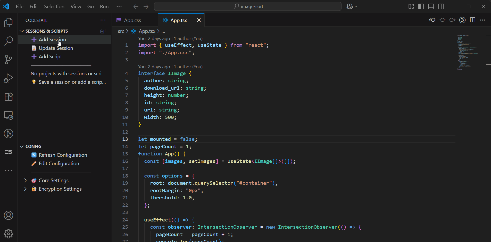

# CodeState IDE

Save and restore your VS Code development sessions with full context - your "save game" button for development.

[](https://marketplace.visualstudio.com/items?itemName=karthikchinasani.codestate-ide)
[](https://code.visualstudio.com/)



## 🚀 What is CodeState IDE?

CodeState IDE is a powerful productivity extension that helps developers capture, save, and restore their entire working context with a single command. Think of it as a "save game" button for your development environment - you can pause work at any moment and later resume exactly where you left off, with full continuity and minimal friction.

## ✨ Key Features

### 🎯 **Session Save & Resume**
- Instantly save your current development session including open files, terminal sessions, and project state
- Resume any saved session with a single command
- Never lose your work context again

### 📁 **Context Snapshot**
- Capture the exact state of your work environment
- Save notes and tags for easy searching and filtering
- Maintain full development context across sessions

### 🔄 **Seamless Git Integration**
- Automatically records current branch and commit state
- Optionally stash uncommitted changes for clean restoration
- Perfect for switching between features or projects

### 💻 **Terminal Process Management**
- Restores terminal sessions and commands
- Pick up running processes or development servers without manual setup
- Maintain your development workflow continuity

### 📋 **Session Management**
- List, search, and filter past sessions by name, tag, or recency
- Visualize your work history in the dedicated sidebar
- Quick access to any previous development state

## 🎮 How to Use

### Quick Start

1. **Save a Session**: When you want to pause work, use the command palette:
   - Press `Ctrl+Shift+P` (Windows/Linux) or `Cmd+Shift+P` (Mac)
   - Type "CodeState: Save Session"
   - Enter a session name and optional notes

2. **Resume a Session**: To get back to work:
   - Press `Ctrl+Shift+P` (Windows/Linux) or `Cmd+Shift+P` (Mac)
   - Type "CodeState: Resume Session"
   - Select from your saved sessions

3. **Manage Sessions**: Use the CodeState sidebar to:
   - View all saved sessions
   - Search and filter sessions
   - Delete or rename sessions
   - Manage scripts and configurations

### Available Commands

| Command | Description |
|---------|-------------|
| `CodeState: Save Session` | Save current development context |
| `CodeState: Resume Session` | Restore a previously saved session |
| `CodeState: List Sessions` | View all saved sessions |
| `CodeState: Delete Session` | Remove a saved session |
| `CodeState: Create Session` | Create a new session with custom settings |
| `CodeState: Create Script` | Add automation scripts to sessions |
| `CodeState: Edit Configuration` | Customize extension settings |

## 🎯 Perfect For

- **Developers** who frequently switch between tasks, features, or projects
- **Teams** that need to hand off work or onboard new members
- **Anyone** who wants to reduce cognitive load and avoid losing context
- **Remote workers** who need to maintain development state across devices

## ⚙️ Configuration

The extension provides several configuration options:

```json
{
  "codestate.logging.enabled": false,
  "codestate.logging.level": "none"
}
```

### Settings

- **`codestate.logging.enabled`**: Enable console logging for debugging purposes
- **`codestate.logging.level`**: Set logging level (`none`, `error`, `warn`, `info`, `debug`)

## 🏗️ Architecture

CodeState IDE is built with clean architecture principles:

- **Domain Layer**: Core business entities and session management logic
- **Application Layer**: Use cases and application services
- **Infrastructure Layer**: VS Code API integration and storage
- **Presentation Layer**: UI components and command handlers

## 🔧 Requirements

- VS Code 1.82.0 or higher
- No additional dependencies required

## 📦 Installation

1. Open VS Code
2. Go to Extensions (`Ctrl+Shift+X`)
3. Search for "CodeState IDE"
4. Click Install

## �️ CLI Version

Prefer using the command line? Try [CodeState CLI](https://www.npmjs.com/package/codestate-cli) for session management outside VS Code.

### Installation

Install globally with:

```bash
npm install -g codestate-cli
```

### Features

The CLI version provides the same powerful session management capabilities:

- **Save Sessions**: Capture your current development state
- **Resume Sessions**: Restore any saved session with full context
- **List Sessions**: View and manage all your saved sessions
- **Git Integration**: Automatic branch and stash management
- **Script Execution**: Run project-specific scripts on session resume
- **IDE Integration**: Open sessions in your preferred IDE

### Quick CLI Usage

```bash
# Save current session
codestate save

# Resume a session
codestate resume

# List all sessions
codestate list

# Resume specific session by name
codestate resume "my-session-name"
```

See the [codestate-cli documentation](https://www.npmjs.com/package/codestate-cli) for complete usage and features.

## �🚀 Getting Started

1. **Install the extension** from the VS Code marketplace
2. **Open the CodeState sidebar** - you'll see a new icon in the activity bar
3. **Save your first session** using the command palette
4. **Resume sessions** whenever you need to get back to work


## 📝 Release Notes

### 1.0.2
- Enhanced session resume functionality with OpenFiles integration
- Improved cross-window session restoration
- Better IDE configuration support
- Bug fixes and performance improvements

### 1.0.0
- Initial release with core session save/resume functionality
- VS Code integration with sidebar and command palette
- Git state capture and restoration
- Terminal session management
- Session listing and management UI

## 📄 License

This extension is licensed under the MIT License.

## 🔗 Links

- [CodeState Website](https://www.codestate.dev/) - Official landing page
- [GitHub Repository](https://github.com/codestate-cs/code-state-ide)
- [Issues & Feedback](https://github.com/codestate-cs/code-state-ide/issues)
- [VS Code Extension Guidelines](https://code.visualstudio.com/api/references/extension-guidelines)

---

**Enjoy seamless development with CodeState IDE!** 🎉

*Never lose your development context again - save, switch, and resume with confidence.*
